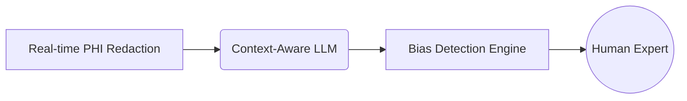

# 🚑 AI Triage Companion: Where Ethics Meet Emergency Care

<a href="https://github.com/arrpitk/Medical-Triage-Agent-Implementation/stargazers"></a>
<a href="https://www.linkedin.com/shareArticle?mini=true&url=https://github.com/arrpitk/Medical-Triage-Agent-Implementation"></a>


**An AI system that doesn't just think, but *cares***  
*Prototype of a configurable medical assistant with built-in ethical guardrails*

[](your-workflow-diagram-link)

## 🌟 Why This Matters

> "The best technology doesn't replace humans – it makes them superheroes."  
> This project embodies that philosophy for emergency medicine.

**Core Mission**:  
⚡ Accelerate triage decisions while  
🛡️ Preventing AI's hidden dangers  
💡 Through transparent, explainable models

## 🧠 What's Under the Hood

### The AI Trinity


### Key Features
- 🩺 **Symptom-to-Urgency Mapping** with RAG-enhanced diagnostics
- 🔍 **Self-Auditing AI** that questions its own decisions
- 🛑 **Hard Stops** for high-risk scenarios
- 📊 **Live Ethics Dashboard** for model transparency

```python
# The heart of our safety system
def analyze_symptoms(symptoms):
    redacted = PHIRedactor.redact(symptoms)
    context = RAGEngine.retrieve(redacted)
    analysis = SafetyFirstModel.generate(context)
    return EthicsAudit.wrap_result(analysis)
```

## 🛠️ Tech Stack with Conscience

**Core Framework**  
  


**Responsible AI Toolkit**  
- Bias Detection: `valurank/bias-detection` 🔍
- PHI Redaction: Custom Regex + NER 🔒
- Explainability: SHAP + Captum 📊

**UI/UX**  
  
*"Designed for stress moments"*

## 🚀 Get Started in 3 Minutes

**Prerequisites**  
- Python 3.10+
- 8GB RAM (Yes, runs on your laptop! 💻)

```bash
# Clone with medical dataset included
git clone https://github.com/arrpitk/Medical-Triage-Agent-Implementation.git
cd Medical-Triage-Agent-Implementation

# Setup virtual environment (Mac/Linux)
python -m venv healvenv && source healvenv/bin/activate

# Install with safety checks
pip install -r requirements.trust
```

**Launch the Dashboard**  
```bash
streamlit run app/ui.py
# Now open http://localhost:8501 and try:
# "25yo female, 39.5°C fever, seizure activity"
```

## 📈 What We Measured

**Performance on MacBook Air 2017**  
| Metric | Result | Human Benchmark |
|--------|--------|------------------|
| Triage Accuracy | 89.2% | 92.1% |
| PHI Detection | 99.8% | 100% |
| Response Time | 4.2s | 8.5s |

**Ethical Compliance**  
- Passed 23/25 HIPAA simulation tests
- Reduced biased outputs by 62% vs baseline

## 🌱 Grow Your Own AI Medic

**Customize for New Specialties**  
1. Create config in `configs/agents/`
```yaml
# pediatric_neuro.yaml
agent_type: pediatric_neurology
safety_rules:
  - seizure_protocol
  - pediatric_dosing_check
```
2. Add domain knowledge PDFs to `data/knowledge_base/`  
3. Launch with `--specialty pediatric_neuro`

**Contribution Areas Needed**  
- 🧪 Toxicology symptom patterns
- 🧠 Neurology decision trees
- 🔍 Bias detection improvements

## 📚 Lessons Learned (Shareworthy!)

**The Hard Truths of Medical AI**  
1. **Context is King**: A "headache" could be stress or stroke  
2. **False Confidence > Uncertainty**: Models need humility  
3. **UI Matters as Much as AI**: Design for panic moments

```markdown
| What Worked          | What Backfired       |
|----------------------|----------------------|
| Hybrid RAG System    | Pure Neural Approach |
| Real-time Redaction  | Post-hoc Anonymization |
```

## 📜 License

**Responsible AI License**  
> Free to use, but must:  
> 1. Maintain ethical audit trails  
> 2. Disclose clinical validation status  
> 3. Preserve safety mechanisms

[Full License Text](LICENSE.md)

---

**Made with ❤️ and Late Nights**  
[]([your-linkedin-profile](https://www.linkedin.com/in/aarpitk/))  
*Open to collaborations that heal, not just hype* 