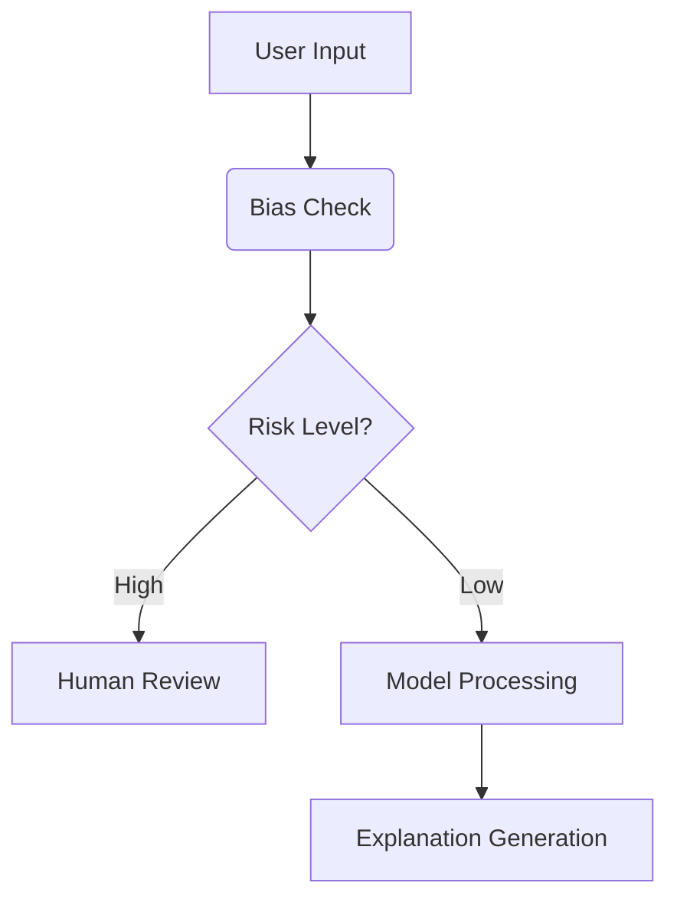

# Ethical AI Framework for Medical Agents

## 1. Privacy & Security
- **PHI Redaction**: All patient identifiers must be removed using:
  ```python
  PHIRedactor().redact(text)
  ```
- **Data Encryption**: Use AES-256 for stored data
- **Access Control**: Role-based access to sensitive information

## 2. Bias Mitigation
- Mandatory checks for:
  - Racial disparities in pain assessment
  - Gender bias in diagnosis recommendations
  - Age-related stereotyping
- Audit trail for all model decisions

## 3. Transparency & Explainability


## 4. Safety Controls
- **Hard Stops** for:
  - Suicide risk indicators
  - Child abuse mentions
  - Violence potential
- **Escalation Protocol**:
  1. Immediate alert to supervising physician
  2. Local crisis resources display
  3. Session termination after 5min

## 5. Accountability
- Version control for:
  - Model weights
  - Training data
  - Ethical guidelines
- Quarterly third-party audits